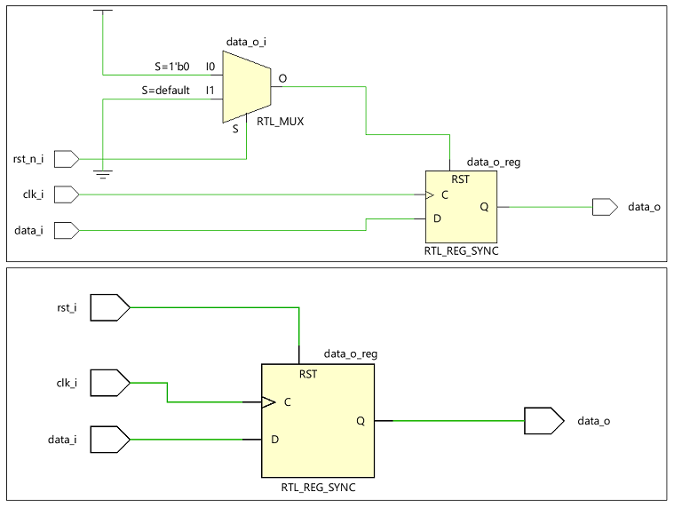
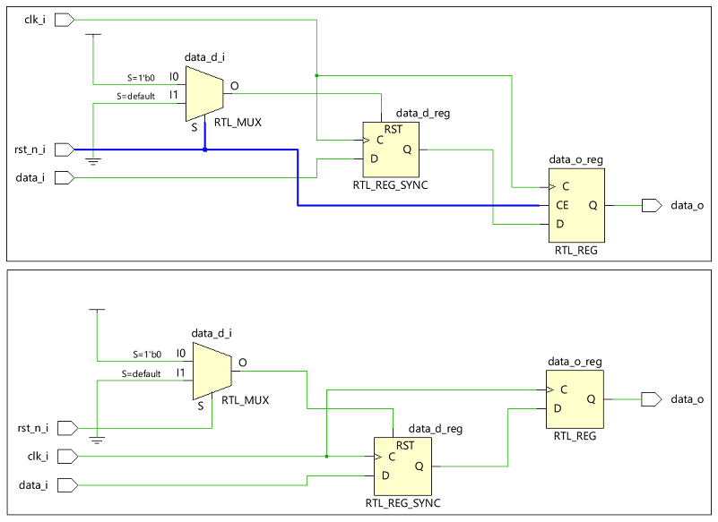
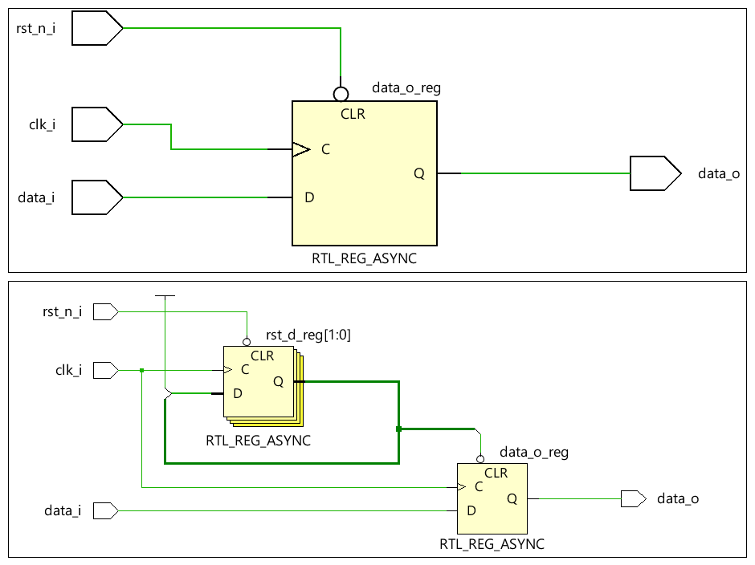
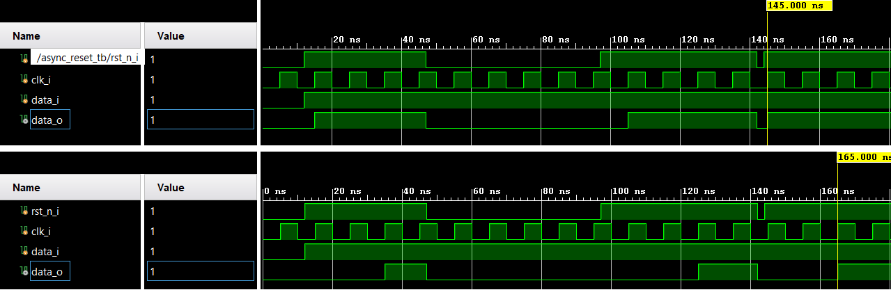
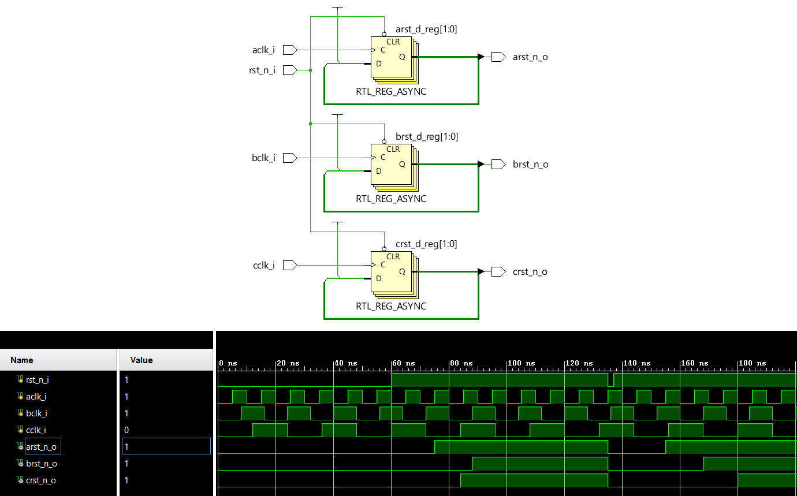
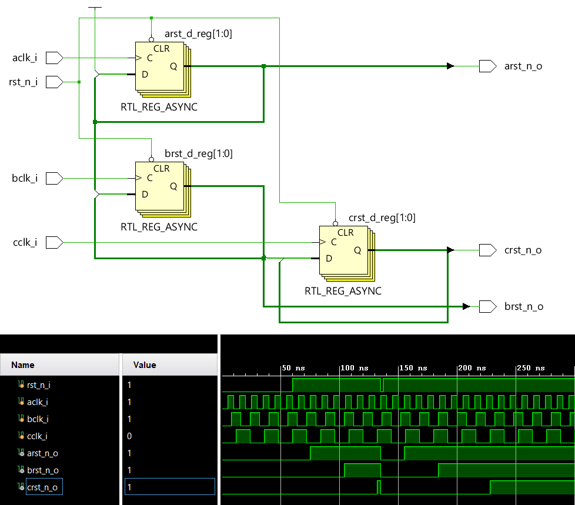

# Resets

## Table of Contents

- [Active High Versus Active Low](#Active-High-Versus-Active-Low)
- [Synchronuos Reset](#Synchronuos_Reset)
- [Asynchronuos Reset](#Asynchronuos_Reset)
- [Multiclock Reset](#Multiclock_Reset)
  * [Non Coordinated Reset Removal](#Non_Coordinated_Reset_Removal)
  * [Sequenced Reset Removal](#Sequenced_Reset_Removal)
- [References](#References)

## Useful Definitions

Reset: Reset is used to bring back the circuit to known state.

Reset Recovery Time: Time between reset deassertion and next clock edge, also defined as reset inactive setup time before clock edge.

## Active High Versus Active Low 
In xilinx 7 series FPGAs synchronous reset FDRE primitives have active high reset pins, using active low would add an extra inverter. In ultrascale FPGAs the polarity of reset pin is configurable. So it is better to have the polarity of reset accordingly.
Apart from this ground is always a valid reference point even when circuits are powered down or across various power domains hence active low resets are preferable.

Synthesized circuit of active low synchronous reset versus active high synchronous reset targeting xilinx 7 series FPGA.

## Synchronuos Reset
* Pros: 
Reset signal will effect the circuit on the active edge of the clock, hence keeps the circuit fully synchronous.

Can be synthesized to smaller flops by combinig reset with the input, in this case combinational logic will be added. Another approach is to use flops with synchronous reset pin.

* Cons: 
If we want to reset the circuit and if clock is not avilable, then reset will not be applied, in case of systems where clock is not stable reset is held until clock gets locked. 

If reset is applied and active clock edge is not avilable then reset will be missed, this problem can be solved by pulse strecher.

Adding pulse stretcher can avoid missing of reset pulse.

Care must be taken while modelling resettable and non-resettable follower flops using synchronous reset, if dissimilar flops are modelled using same procedural block extra data enable logic will be added for follower flops.

## Asynchronous Reset

* Pros:

Reset will not depend upon clock, Reset has heigher priority compared to inputs. Good to use when in case of dependent and gated clocks.

* Cons:

Both assertion and deassertion are asynchronous hence, reset removal must be handled carefully else it may lead to metastability, this can be solved using reset synchronizer.

Synthesized circuit of active low asynchronous reset without and with reset synchronizer.

Simulation waveforms of async reset without and with reset synchronizer.

## Multiclock Reset

### Non Coordinated Reset Removal

For cases where reset removed within one clock domain compared to when it is removed in another clock domain is not important, then reset synchronizers are sufficient in each clock domain.

Example where reset removal of clock domains need not be prioritized.

### Sequenced Reset Removal

For designs where reset removal needs to be ordered must have prioritized asynchronous reset synchronizers.

Example where reset of clock domain A needs to be removed first, reset of B clock domain needs to be removed next and at last reset of C clock domain must be removed.

## References

* Xilinx Blog: Demystifying Resets: Synchronous, Asynchronous other Design Considerations... Part 1
* Xilinx Blog: Demystifying Resets: Synchronous, Asynchronous and other Design Considerations... Part 2
* Sunburst Paper: Asynchronous & Synchronous Reset Design Techniques - Part Deux
